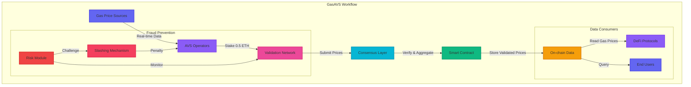

# 🔮 GasAVS - Ethereum Gas Price AVS (Anti-Fraud Validation Service)


## 🎯 AVS Architecture & Workflow




### Workflow Explanation:

1. **Data Collection Layer** (Purple)
   - Multiple gas price sources feed real-time data
   - AVS operators collect and process raw data

2. **Validation Layer** (Pink)
   - Staked operators validate price submissions
   - Consensus mechanisms ensure data accuracy

3. **Consensus Layer** (Blue)
   - Aggregates validated prices
   - Applies weighted averaging based on stake

4. **Smart Contract Layer** (Green)
   - Stores validated gas prices on-chain
   - Manages operator stakes and rewards

5. **Security Layer** (Red)
   - Monitors for suspicious activity
   - Handles fraud proofs and slashing

6. **Consumer Layer** (Orange)
   - DeFi protocols consume validated prices
   - End users query current gas prices

## 🎯 AVS Overview

GasAVS is an Anti-Fraud Validation Service built on Ethereum using the AVS (Anti-Fraud Validation Service) framework. It provides decentralized gas price validation through a network of AVS operators who stake ETH to participate in the validation process, ensuring accurate and manipulation-resistant gas price reporting.

## 💡 Why GasAVS?

Gas price manipulation and front-running have become significant issues in the Ethereum ecosystem. GasAVS addresses these challenges by:
- Providing decentralized validation of gas prices
- Preventing price manipulation through stake-based consensus
- Offering real-time, reliable gas price data
- Implementing anti-fraud mechanisms using AVS framework

## 🏗️ AVS Architecture

### Core Components
- **AVS Operators**: Stake ETH to participate in validation
- **Risk Module**: Monitors price deviations and potential manipulation
- **Consensus Layer**: Aggregates validator submissions
- **Fraud Proof System**: Identifies and penalizes malicious behavior

### AVS Integration

```solidity
interface IGasAVS {
    function submitGasPrice(uint256 basePrice, uint256 priorityPrice) external;
    function validateSubmission(bytes calldata proof) external returns (bool);
    function challengeSubmission(uint256 submissionId, bytes calldata fraudProof) external;
}
```

## 🛠️ Technical Stack

- **AVS Framework**: Eig

## 🚀 Features

- **Decentralized Validation**: Multiple validators ensure accurate gas price reporting
- **Stake-Based Participation**: Validators stake 0.5 ETH to participate
- **Real-Time Updates**: Gas prices are updated every 30 seconds
- **Price Deviation Control**: Built-in mechanisms to prevent extreme price fluctuations
- **User-Friendly Interface**: Clean, dark-themed UI for easy interaction
- **Web3 Integration**: Seamless connection with MetaMask and other Web3 wallets

## 📋 Prerequisites

- Node.js (v14+ recommended)
- npm or yarn
- MetaMask or similar Web3 wallet
- Git

## 🔧 Installation

1. Clone the repository: 
